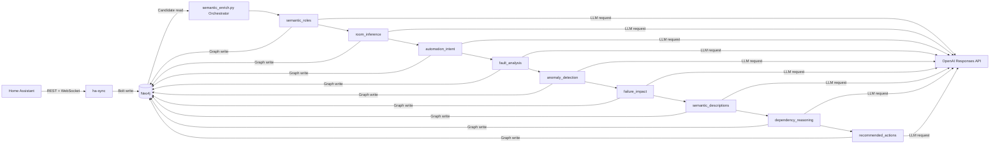

# Functional Description

Diese Datei beschreibt, wie der Code funktioniert und wie die Abhaengigkeiten im Projekt aufgebaut sind.

## 1. Gesamtueberblick

Das Repository implementiert zwei Haupt-Pipelines:

1. `ha-sync`: Liest Daten aus Home Assistant und schreibt sie als Graph nach Neo4j.
2. `semantic-enrichment`: Liest Graph-Kandidaten aus Neo4j und reichert sie mit LLM-basierten Semantiken an.

Die zentrale Laufzeitsequenz ist:

1. Home Assistant -> `ha-sync`
2. `ha-sync` -> Neo4j
3. `semantic-enrichment` -> liest aus Neo4j
4. `semantic-enrichment` -> OpenAI Responses API
5. `semantic-enrichment` -> schreibt Ergebnis nach Neo4j

## 1.1 Architekturdiagramm

## 2. Wichtige Einstiegspunkte

### 2.1 `ha-sync/sync.py`

Verantwortung:

- Abfragen gegen Home Assistant (`/api/states`, Registry-Endpunkte)
- Normalisierung von Attributen
- Persistenz in Neo4j (Knoten + Kanten)
- Wiederholter Sync in Intervallen

Direkte technische Abhaengigkeiten:

- `requests`
- `websocket-client`
- `pyyaml`
- `neo4j`

### 2.2 `semantic-enrichment/semantic_enrich.py`

Verantwortung:

- Startet den Enrichment-Orchestrator
- Wartet auf Neo4j-Verfuegbarkeit
- Initialisiert alle Enricher
- Fuehrt jeden Enricher zyklisch aus (`while True`)

## 3. Enrichment-Architektur

### 3.1 Basisklasse: `semantic-enrichment/enrichers/base.py`

`BaseEnricher` kapselt den gemeinsamen Ablauf:

1. `setup()` -> ruft `create_constraints()`
2. `run_once()`:
   - `get_candidates(limit)`
   - `call_llm(payload)` mit JSON-Schema
   - `validate_items(...)`
   - `write_results(items)`

Damit muessen konkrete Enricher nur die fachspezifischen Teile implementieren.

### 3.2 Aktive Enricher

Die aktuell verdrahtete Reihenfolge in `semantic_enrich.py`:

1. `SemanticRolesEnricher`
2. `RoomInferenceEnricher`
3. `AutomationIntentEnricher`
4. `FaultAnalysisEnricher`
5. `AnomalyDetectionEnricher`
6. `FailureImpactEnricher`
7. `SemanticDescriptionsEnricher`
8. `DependencyReasoningEnricher`
9. `RecommendedActionsEnricher`

## 4. Fachliche Abhaengigkeiten der Enricher

### 4.1 Fruehe Basis-Enricher

- `semantic_roles` liefert grundlegende Klassifikation (`Role`, `Category`, `Criticality`).
- `room_inference` liefert Lage-/Area-Kontext.

Diese Ergebnisse verbessern nachgelagerte Enricher.

### 4.2 Analyse-Enricher

- `automation_intent` analysiert Automationen.
- `fault_analysis` analysiert problematische Entities.
- `anomaly_detection` erkennt Anomalien aus Zustands- und Event-Kontext.

### 4.3 Abgeleitete Enricher

- `failure_impact` nutzt u. a. Semantik, Criticality, Area und Automationsbezug.
- `semantic_descriptions` nutzt vorhandenen semantischen Kontext fuer beschreibende Texte.
- `dependency_reasoning` erkennt Beziehungen zwischen Entities.

### 4.4 Abschluss-Enricher

- `recommended_actions` laeuft zuletzt, da es mehrere Voranalysen konsolidiert
  (z. B. Anomalien, Faults, Failure Impact).

## 5. Daten- und Dateiabhaengigkeiten

Jeder Enricher hat drei zentrale statische Angaben:

1. `prompt_file` -> Datei unter `semantic-enrichment/prompts/`
2. `schema_file` -> Datei unter `semantic-enrichment/schemas/`
3. `response_key` -> JSON-Feldname, der aus der LLM-Antwort gelesen wird

Beispiel:

- `RecommendedActionsEnricher`
  - Prompt: `prompts/recommended_actions.md`
  - Schema: `schemas/recommended_actions_schema.json`
  - Key: `recommended_actions`

Wenn Prompt/Schema nicht existieren oder nicht zum `response_key` passen,
schlaegt der Lauf zur Laufzeit fehl.

## 6. Externe Abhaengigkeiten

### 6.1 Infrastruktur

- Neo4j (Bolt)
- Home Assistant API
- OpenAI Responses API

### 6.2 Python-Packages

`ha-sync/requirements.txt`:

- `requests`
- `neo4j`
- `websocket-client`
- `pyyaml`

`semantic-enrichment/requirements.txt`:

- `openai`
- `neo4j`
- `python-dotenv`

## 7. Konfiguration

Die Enrichment-Konfiguration sitzt in `semantic-enrichment/config.py`.

Wichtige Variablen:

- `OPENAI_API_KEY`
- `OPENAI_MODEL`
- `NEO4J_URI`
- `NEO4J_USER`
- `NEO4J_PASSWORD`
- `BATCH_SIZE`
- `SLEEP_SECONDS`
- `MIN_CONFIDENCE`

Pfadvariablen:

- `PROMPTS_DIR`
- `SCHEMAS_DIR`

## 8. Laufzeitverhalten und Fehlertoleranz

- Der Orchestrator faengt Exceptions pro Enricher ab.
- Ein fehlerhafter Enricher stoppt nicht den gesamten Zyklus.
- Nach jedem vollen Durchlauf wird `SLEEP_SECONDS` gewartet.

## 9. CI-Absicherung

Die CI (`.github/workflows/ci.yml`) prueft unter Ubuntu und Debian u. a.:

1. Syntax (`compileall`)
2. Enricher-Wiring (`scripts/ci_validate_enrichment.py`)
3. Import-Smoketest
4. Docker-Compose-Konfiguration (Ubuntu-Job)

Damit werden Strukturfehler (fehlende Prompts/Schemas, falsche Verdrahtung,
leere Module, doppelte Legacy-Dateien) frueh erkannt.

## 10. Kurzfazit

Das System ist modular aufgebaut:

- `ha-sync` erstellt den operativen Graph.
- `semantic-enrichment` erweitert ihn in klar getrennten, wiederverwendbaren Enrichern.
- `BaseEnricher` sorgt fuer konsistente Ausfuehrung.
- Die Enricher-Reihenfolge ist bewusst entlang fachlicher Abhaengigkeiten gestaltet.
