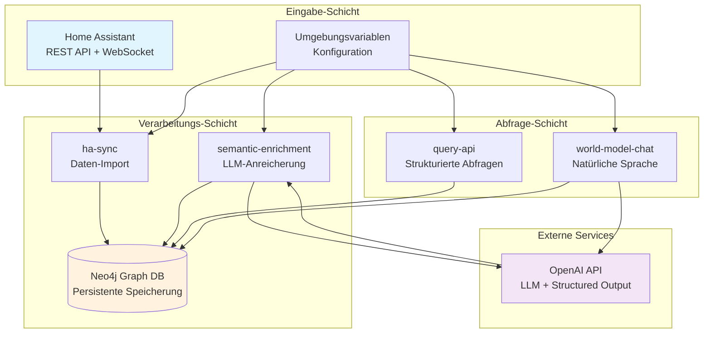
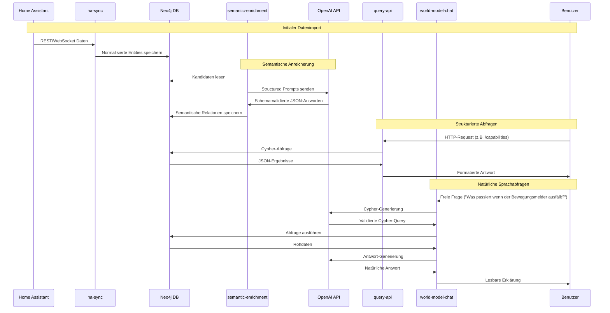
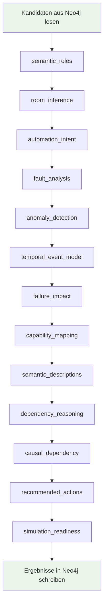
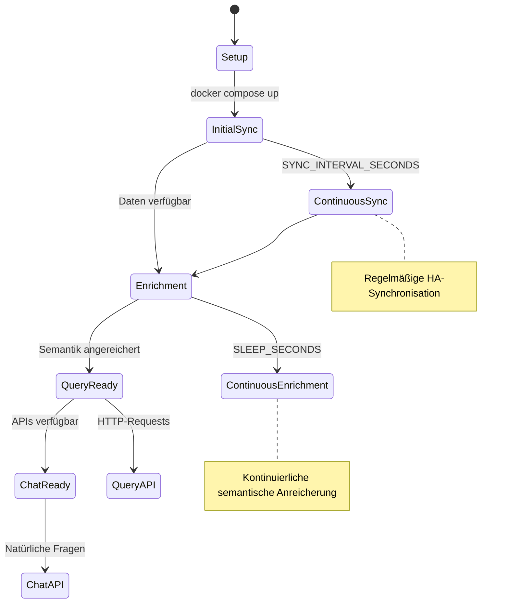

# Funktionale Beschreibung: HA-CPsWMS

## Übersicht

HA-CPsWMS (Home Assistant - Canonical Entity Layer + Semantic World Model System) ist ein umfassendes System zur Erstellung eines semantischen Weltmodells für Smart-Home-Umgebungen. Das System transformiert Rohdaten aus Home Assistant in ein intelligentes, abfragbares Modell, das nicht nur technische Fakten speichert, sondern auch semantische Bedeutung, Abhängigkeiten und Kausalzusammenhänge versteht.

### Kernfunktionalität

Das System löst folgende zentrale Herausforderungen:

1. **Semantische Lücke schließen**: Aus technischen Entity-IDs werden verständliche Rollen und Funktionen
2. **Stabile Identitäten schaffen**: Raw Entities werden zu Canonical Entities normalisiert
3. **Intelligente Abhängigkeiten modellieren**: Automatisierungen, Capabilities und Kausalbeziehungen
4. **What-if-Analysen ermöglichen**: Simulation von Ausfällen und deren Auswirkungen
5. **Natürliche Interaktion**: Freie Fragen werden in präzise Graph-Abfragen übersetzt

## Systemarchitektur

### Gesamtsystem-Übersicht



### Datenfluss-Architektur



## Detaillierte Funktionsbeschreibung

### 1. HA-Sync: Daten-Import und Normalisierung

**Funktion**: Importiert und normalisiert alle relevanten Daten aus Home Assistant in eine graphbasierte Struktur.

**Eingabe**:
- REST API: `/api/states` (aktuelle Zustände aller Entities)
- WebSocket API: `config/config_entries/list` (Integrationen-Registry)
- Umgebungsvariablen: `HA_URL`, `HA_TOKEN`

**Verarbeitung**:
1. **Entity-Normalisierung**: Konvertiert HA-Entity-IDs in standardisierte Knoten
2. **Attribut-Mapping**: Extrahiert relevante Attribute (friendly_name, device_class, etc.)
3. **Beziehungs-Aufbau**: Erstellt Verknüpfungen zwischen Entities, Devices, Areas
4. **Domain-Klassifikation**: Gruppiert Entities nach HA-Domains (light, sensor, etc.)

**Ausgabe**: Normalisierte Graph-Struktur in Neo4j mit folgenden Hauptknoten:
- `Entity`: Einzelne HA-Entities mit allen Attributen
- `Device`: Physische Geräte (gruppieren Entities)
- `Area`: Räume/Bereiche
- `Integration`: HA-Integrationen
- `Domain`: HA-Domain-Klassifikationen
- `Automation`: HA-Automatisierungen

**Technische Details**:
- Fallback-Mechanismen für API-Inkompatibilitäten
- Wiederholte Synchronisation in konfigurierbaren Intervallen
- Fehlerbehandlung für Netzwerkprobleme und API-Änderungen

### 2. Semantic-Enrichment: LLM-basierte Anreicherung

**Funktion**: Reicherte die technischen Daten mit semantischer Bedeutung an, indem KI-gestützte Analysen durchgeführt werden.

**Eingabe**:
- Neo4j-Graph mit normalisierten Entities
- OpenAI API für strukturierte Ausgaben
- Spezialisierte Prompts für verschiedene Analyse-Typen

**Verarbeitung**: Orchestriert 13 spezialisierte Enricher in sequentieller Reihenfolge:



#### Enricher-Details:

1. **semantic_roles**: Klassifiziert Entities in fachliche Rollen (Sensor, Aktor, Diagnose)
2. **room_inference**: Schließt Raum-Zuordnungen aus Entity-Namen und Attributen
3. **automation_intent**: Analysiert Automatisierungs-Zwecke und -Logik
4. **fault_analysis**: Identifiziert mögliche Fehlerquellen und Diagnosemuster
5. **anomaly_detection**: Erkennt ungewöhnliche Zustände und Verhaltensmuster
6. **temporal_event_model**: Modelliert zeitliche Abläufe und Event-Ketten
7. **failure_impact**: Bewertet Auswirkungen von Komponentenausfällen
8. **capability_mapping**: Ordnet Entities zu funktionalen Capabilities (Beleuchtung, Sicherheit)
9. **semantic_descriptions**: Erstellt menschenlesbare Beschreibungen
10. **dependency_reasoning**: Identifiziert Abhängigkeiten zwischen Komponenten
11. **causal_dependency**: Modelliert Ursache-Wirkungs-Beziehungen
12. **recommended_actions**: Schlägt Handlungsoptionen für verschiedene Szenarien vor
13. **simulation_readiness**: Bewertet Eignung für Simulationen und Tests

**Ausgabe**: Semantisch angereicherte Graph-Struktur mit zusätzlichen Knoten und Beziehungen:
- `SemanticRole`, `SemanticCategory`, `Criticality`
- `Capability`, `AutomationIntent`
- `FaultType`, `AnomalyType`
- `FailureImpactLevel`, `RecommendedActionType`
- `SimulationReadinessLevel`

### 3. Query-API: Strukturierte Graph-Abfragen

**Funktion**: Stellt vordefinierte HTTP-Endpunkte für wiederkehrende Analyse-Fragen bereit.

**Eingabe**: HTTP-Requests mit Parametern für Filter und Limits

**Verarbeitung**: Führt optimierte Cypher-Queries gegen Neo4j aus

**Ausgabe**: JSON-formatierte Ergebnisse für verschiedene Analyse-Typen

**Wichtige Endpunkte**:
- `/health`: Systemstatus
- `/entities`: Entity-Übersicht mit Filtern
- `/capabilities`: Capability-Mapping und -Analyse
- `/simulation-readiness`: Simulationsfähigkeit bewerten
- `/what-if-impact`: Auswirkungsanalyse für Szenarien
- `/entity-dependencies`: Abhängigkeitsgraph für Entities

### 4. World-Model-Chat: Natürliche Sprachinteraktion

**Funktion**: Ermöglicht freie Fragen in natürlicher Sprache und übersetzt diese in sichere Graph-Abfragen.

**Eingabe**: Natürlichsprachliche Fragen via HTTP POST

**Verarbeitung**:
1. **Cypher-Generierung**: OpenAI erstellt validierte Cypher-Queries
2. **Sicherheitsvalidierung**: Prüfung auf read-only und ressourcenbegrenzte Queries
3. **Ausführung**: Sichere Query-Ausführung gegen Neo4j
4. **Antwort-Generierung**: OpenAI formuliert menschenlesbare Antworten

**Ausgabe**: Natürlichsprachliche Erklärungen basierend auf Graph-Daten

## Datenmodell und Graph-Struktur

### Kern-Entitäten

```mermaid
classDiagram
    class Entity {
        +entity_id: string
        +friendly_name: string
        +state: string
        +domain: string
        +device_class: string
        +unit_of_measurement: string
    }

    class CanonicalEntity {
        +canonical_id: string
        +canonical_name: string
        +entity_type: string
    }

    class RawEntity {
        +raw_entity_id: string
        +source_entity_id: string
    }

    class SemanticRole {
        +name: string
        +description: string
    }

    class Capability {
        +name: string
        +category: string
        +description: string
    }

    Entity ||--o{ RawEntity : represented_by
    RawEntity ||--|| CanonicalEntity : resolved_to
    CanonicalEntity ||--o{ SemanticRole : has_semantic_role
    Entity ||--o{ Capability : provides_capability
```

### Beziehungs-Typen

**Technische Beziehungen**:
- `BELONGS_TO_DOMAIN`: Entity → Domain
- `PROVIDED_BY`: Entity → Integration
- `LOCATED_IN`: Entity → Area
- `REPRESENTS`: Entity → Device

**Semantische Beziehungen**:
- `HAS_SEMANTIC_ROLE`: Entity → SemanticRole
- `HAS_SEMANTIC_CATEGORY`: Entity → SemanticCategory
- `PROVIDES_CAPABILITY`: Entity → Capability
- `DEPENDS_ON`: Entity → Entity
- `CAUSES`: Entity → Entity
- `HAS_FAILURE_IMPACT`: Entity → FailureImpactLevel

## Betriebsablauf

### 1. Initiales Setup

```bash
# 1. Konfiguration
cp .env.example .env
# Bearbeite .env mit HA_URL, HA_TOKEN, NEO4J_PASSWORD, OPENAI_API_KEY

# 2. System starten
docker compose up -d --build

# 3. Logs überwachen
docker compose logs -f ha-sync
docker compose logs -f semantic-enrichment
```

### 2. Laufender Betrieb



### 3. Monitoring und Wartung

- **Health-Checks**: `/health` Endpunkte für alle Services
- **Logs**: Docker-Compose logs für Debugging
- **Metrics**: Neo4j-Browser für Graph-Inspektion
- **Benchmarks**: Automatische Performance-Messungen

## Konfiguration und Anpassung

### Umgebungsvariablen

**Basis-Konfiguration**:
- `HA_URL`: Home Assistant URL
- `HA_TOKEN`: Long-Lived Access Token
- `NEO4J_URI`: Neo4j-Verbindungsstring
- `NEO4J_PASSWORD`: Datenbank-Passwort

**Performance-Tuning**:
- `SYNC_INTERVAL_SECONDS`: Synchronisations-Intervall (Standard: 300)
- `BATCH_SIZE`: LLM-Batch-Größe (Standard: 20)
- `SLEEP_SECONDS`: Pause zwischen Enrichment-Batches (Standard: 300)

**Qualitäts-Einstellungen**:
- `MIN_CONFIDENCE`: Mindest-Konfidenz für semantische Beziehungen (Standard: 0.5)
- `WORLD_MODEL_CHAT_MIN_CYPHER_CONFIDENCE`: Mindest-Konfidenz für generierte Queries (Standard: 0.4)

## Erweiterte Funktionen

### Canonical Entity Layer

Das System implementiert eine quellenunabhängige Identitätsschicht:

- **Raw Entities**: Direkte HA-Entity-Repräsentationen
- **Canonical Entities**: Stabile, semantische Identitäten
- **Evidence**: Begründungen für Normalisierungsentscheidungen
- **Resolution Decisions**: Nachvollziehbare Zuordnungslogik

### Simulation und What-if-Analysen

- **Ausfall-Simulationen**: Berechnung von Impact-Ketten
- **Capability-Analysen**: Verfügbarkeit funktionaler Fähigkeiten
- **Dependency-Reasoning**: Identifikation kritischer Pfade
- **Recommended Actions**: Handlungsempfehlungen für Szenarien

### Natürliche Sprachverarbeitung

- **Kontext-sensitive Abfragen**: Verständnis von "kritischen Sensoren" vs. "Komfort-Features"
- **Sichere Query-Generierung**: Read-only Garantie durch Validierung
- **Erklärbare Antworten**: Nachvollziehbare Begründungen aus Graph-Daten

## Qualitätssicherung

### Automatische Tests

Das System enthält umfassende Benchmark-Funktionen:

- **Technische Metriken**: Laufzeit, Durchsatz, Latenz
- **Graph-Metriken**: Knoten/Beziehungen, Coverage-Ratios
- **Semantische Metriken**: Vollständigkeit, Konfidenz, Erklärbarkeit
- **Query-Performance**: Erfolgsraten, Antwortzeiten

### Validierung

- **Schema-Validierung**: LLM-Outputs gegen JSON-Schemas
- **Konfidenz-Schwellen**: Filter für unsichere Ergebnisse
- **Read-only Garantie**: Sicherheitsprüfungen für generierte Queries

## Ausblick und Erweiterungen

### Potenzielle Erweiterungen

1. **Multi-Source-Integration**: Weitere Smart-Home-Systeme als Datenquellen
2. **Zeitliche Modellierung**: Historische Daten und Trend-Analysen
3. **Predictive Analytics**: Vorhersage von Ausfällen und Verhaltensmustern
4. **Multi-Agent-Systeme**: Koordinierte Entscheidungsfindung
5. **Real-time-Adaptation**: Automatische Anpassung an geänderte Bedingungen

### Skalierbarkeit

- **Horizontale Skalierung**: Mehrere Enrichment-Instanzen
- **Caching-Schichten**: Performance-Optimierung für häufige Queries
- **Graph-Partitionierung**: Aufteilung großer Modelle

Diese funktionale Beschreibung bietet eine vollständige Grundlage für das Verständnis, die Wartung und die Erweiterung des HA-CPsWMS. Sie kann als Basis für Schulungen, Präsentationen und technische Dokumentation dienen.

Direkte technische Abhaengigkeiten:

- `requests`
- `websocket-client`
- `pyyaml`
- `neo4j`

### 2.2 `semantic-enrichment/semantic_enrich.py`

Verantwortung:

- Startet den Enrichment-Orchestrator
- Wartet auf Neo4j-Verfuegbarkeit
- Initialisiert alle Enricher
- Fuehrt jeden Enricher zyklisch aus (`while True`)

### 2.3 `query-api/app.py`

Verantwortung:

- Stellt feste read-only HTTP-Endpunkte fuer haeufige Graph-Fragen bereit
- Kapselt Cypher fuer Capabilities, Simulation Readiness, What-if-Szenarien und Entity Impact
- Liest ausschliesslich aus Neo4j und schreibt keine Graphdaten
- Wandelt Neo4j-Datentypen in JSON-kompatible HTTP-Antworten um

Typische Endpunkte:

- `GET /health`
- `GET /api/capabilities`
- `GET /api/simulation-readiness`
- `GET /api/what-if/integration/{domain}`
- `GET /api/what-if/capability/{name}`
- `GET /api/entities/{entity_id}/impact`

### 2.4 `world-model-chat/app.py`

Verantwortung:

- Nimmt freie Fragen per `POST /chat` entgegen
- Laesst OpenAI eine strukturierte Cypher-Abfrage erzeugen
- Validiert, dass die Query read-only ist, `RETURN` und `LIMIT` enthaelt und keine Schreiboperation nutzt
- Fuehrt die Query gegen Neo4j aus
- Laesst OpenAI aus Frage, Query und Ergebnisdaten eine Antwort formulieren

Der Service ist bewusst getrennt von `query-api`: `query-api` ist die stabile Maschinen-API,
`world-model-chat` ist die flexible Sprachschnittstelle.

## 3. Enrichment-Architektur

### 3.1 Basisklasse: `semantic-enrichment/enrichers/base.py`

`BaseEnricher` kapselt den gemeinsamen Ablauf:

1. `setup()` -> ruft `create_constraints()`
2. `run_once()`:
   - `get_candidates(limit)`
   - `call_llm(payload)` mit JSON-Schema
   - `validate_items(...)`
   - `write_results(items)`

Damit muessen konkrete Enricher nur die fachspezifischen Teile implementieren.

### 3.2 Aktive Enricher

Die aktuell verdrahtete Reihenfolge in `semantic_enrich.py`:

1. `SemanticRolesEnricher`
2. `RoomInferenceEnricher`
3. `AutomationIntentEnricher`
4. `FaultAnalysisEnricher`
5. `AnomalyDetectionEnricher`
6. `TemporalEventModelEnricher`
7. `FailureImpactEnricher`
8. `CapabilityMappingEnricher`
9. `SemanticDescriptionsEnricher`
10. `DependencyReasoningEnricher`
11. `CausalDependencyEnricher`
12. `RecommendedActionsEnricher`
13. `SimulationReadinessEnricher`

## 4. Fachliche Abhaengigkeiten der Enricher

### 4.1 Fruehe Basis-Enricher

- `semantic_roles` liefert grundlegende Klassifikation (`Role`, `Category`, `Criticality`).
- `room_inference` liefert Lage-/Area-Kontext.

Diese Ergebnisse verbessern nachgelagerte Enricher.

### 4.2 Analyse-Enricher

- `automation_intent` analysiert Automationen.
- `fault_analysis` analysiert problematische Entities.
- `anomaly_detection` erkennt Anomalien aus Zustands- und Event-Kontext.
- `temporal_event_model` erzeugt zeitbezogene Ereignisstrukturen (`Observation`, `StateTransition`, `TimelineEvent`, `Incident`).

### 4.3 Abgeleitete Enricher

- `failure_impact` nutzt u. a. Semantik, Criticality, Area und Automationsbezug.
- `capability_mapping` erzeugt explizite `PROVIDES_CAPABILITY`-Beziehungen
  zwischen Entities und `Capability`-Knoten.
- `semantic_descriptions` nutzt vorhandenen semantischen Kontext fuer beschreibende Texte.
- `dependency_reasoning` erkennt Beziehungen zwischen Entities.
- `causal_dependency` leitet Kausalketten aus Faehigkeiten, Zeitdaten, Incidents
  und Automationsbeziehungen ab.

### 4.4 Abschluss-Enricher

- `recommended_actions` konsolidiert mehrere Voranalysen
  (z. B. Anomalien, Faults, Failure Impact, temporales Ereignismodell).
- `simulation_readiness` ist die spaeteste Schicht und bewertet, ob fuer
  Was-waere-wenn-Simulationen genug Faehigkeiten, Dependencies,
  Fehlerhistorie, Automationsbeziehungen und kritische Entities vorhanden sind.

## 5. Daten- und Dateiabhaengigkeiten

Jeder Enricher hat drei zentrale statische Angaben:

1. `prompt_file` -> Datei unter `semantic-enrichment/prompts/`
2. `schema_file` -> Datei unter `semantic-enrichment/schemas/`
3. `response_key` -> JSON-Feldname, der aus der LLM-Antwort gelesen wird

Beispiel:

- `TemporalEventModelEnricher`
  - Prompt: `prompts/temporal_event_model.md`
  - Schema: `schemas/temporal_event_model_schema.json`
  - Key: `temporal_events`

Wenn Prompt/Schema nicht existieren oder nicht zum `response_key` passen,
schlaegt der Lauf zur Laufzeit fehl.

## 6. Externe Abhaengigkeiten

### 6.1 Infrastruktur

- Neo4j (Bolt)
- Home Assistant API
- OpenAI Responses API

### 6.2 Python-Packages

`ha-sync/requirements.txt`:

- `requests`
- `neo4j`
- `websocket-client`
- `pyyaml`

`semantic-enrichment/requirements.txt`:

- `openai`
- `neo4j`
- `python-dotenv`

`query-api/requirements.txt`:

- `neo4j`

`world-model-chat/requirements.txt`:

- `fastapi`
- `uvicorn[standard]`
- `neo4j`
- `openai`
- `python-dotenv`

## 7. Konfiguration

Die Enrichment-Konfiguration sitzt in `semantic-enrichment/config.py`.

Wichtige Variablen:

- `OPENAI_API_KEY`
- `OPENAI_MODEL`
- `NEO4J_URI`
- `NEO4J_USER`
- `NEO4J_PASSWORD`
- `BATCH_SIZE`
- `SLEEP_SECONDS`
- `MIN_CONFIDENCE`

Pfadvariablen:

- `PROMPTS_DIR`
- `SCHEMAS_DIR`

Die Query-API-Konfiguration sitzt direkt in `query-api/app.py`.

Wichtige Variablen:

- `NEO4J_URI`
- `NEO4J_USER`
- `NEO4J_PASSWORD`
- `QUERY_API_PORT`
- `QUERY_API_DEFAULT_LIMIT`
- `QUERY_API_MAX_LIMIT`

Die World-Model-Chat-Konfiguration sitzt in `world-model-chat/config.py`.

Wichtige Variablen:

- `OPENAI_API_KEY`
- `OPENAI_MODEL`
- `NEO4J_URI`
- `NEO4J_USER`
- `NEO4J_PASSWORD`
- `WORLD_MODEL_CHAT_PORT`
- `WORLD_MODEL_CHAT_MAX_QUERY_ROWS`
- `WORLD_MODEL_CHAT_MIN_CYPHER_CONFIDENCE`

## 8. Laufzeitverhalten und Fehlertoleranz

- Der Orchestrator faengt Exceptions pro Enricher ab.
- Ein fehlerhafter Enricher stoppt nicht den gesamten Zyklus.
- Nach jedem vollen Durchlauf wird `SLEEP_SECONDS` gewartet.
- `query-api` beantwortet nur vorbereitete GET-Abfragen und ist read-only.
- `world-model-chat` blockiert schreibende oder administrative Cypher-Bestandteile,
  bevor eine LLM-generierte Query Neo4j erreicht.

## 9. CI-Absicherung

Die CI (`.github/workflows/ci.yml`) prueft unter Ubuntu und Debian u. a.:

1. Syntax (`compileall`)
2. Enricher-Wiring (`scripts/ci_validate_enrichment.py`)
3. Import-Smoketest
4. Docker-Compose-Konfiguration (Ubuntu-Job)

Damit werden Strukturfehler (fehlende Prompts/Schemas, falsche Verdrahtung,
leere Module, doppelte Legacy-Dateien) frueh erkannt.

## 10. Kurzfazit

Das System ist modular aufgebaut:

- `ha-sync` erstellt den operativen Graph.
- `semantic-enrichment` erweitert ihn in klar getrennten, wiederverwendbaren Enrichern.
- `query-api` kapselt stabile, vorbereitete Graph-Abfragen.
- `world-model-chat` erlaubt freie Fragen auf Basis validierter read-only Cypher-Abfragen.
- `BaseEnricher` sorgt fuer konsistente Ausfuehrung.
- Die Enricher-Reihenfolge ist bewusst entlang fachlicher Abhaengigkeiten gestaltet.
