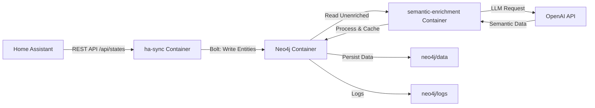

# Home Assistant to Neo4j Sync + Semantic Enrichment

Dieses Projekt synchronisiert Home Assistant Entity-States nach Neo4j und bereichert diese mit semantischen Informationen mittels OpenAI.

## Komponenten

- **Neo4j Datenbank**: Graph-Datenbank für Entity-Speicherung und Beziehungen
- **ha-sync**: Synchronisiert Home Assistant Entities nach Neo4j
- **semantic-enrichment**: Bereichert Entities mit semantischen Rollen und Kategorien mittels OpenAI

## Inhalt

- `docker-compose.yml` - Startet Neo4j, ha-sync und semantic-enrichment Container
- `ha-sync/` - Synchronisiert Home Assistant States nach Neo4j
  - `Dockerfile` - Build-Definition für den Sync-Container
  - `requirements.txt` - Python-Abhängigkeiten
  - `sync.py` - Sync-Skript
- `semantic-enrichment/` - Bereichert Entities mit semantischen Informationen
  - `Dockerfile` - Build-Definition für den Enrichment-Container
  - `requirements.txt` - Python-Abhängigkeiten (openai, neo4j)
  - `semantic_enrich.py` - Enrichment-Skript
  - `prompts/` - System-Prompts für OpenAI
  - `schemas/` - JSON-Schemas für die Antworten
- `neo4j/` - Neo4j-Daten- und Log-Verzeichnis (nicht im Git)
- `.env.example` - Beispiel für Umgebungsvariablen

## Vorbereitung für Git

- `neo4j/data/` und `neo4j/logs/` sind in `.gitignore` enthalten, damit lokale Daten und Logs nicht ins Repository gelangen.
- `.env`-Dateien sind ebenfalls ignoriert.

## Setup

1. `.gitignore` prüfen und sicherstellen, dass lokale Datenverzeichnisse nicht versioniert werden.
1. Erstelle oder aktualisiere die Datei `.env` anhand von `.env.example`.
2. `docker-compose.yml` verwendet die Umgebungsvariablen aus `.env`.
3. Passe die Werte in `.env` an deine Umgebung an:
   - Setze `HA_URL` und `HA_TOKEN` auf deine Home Assistant-Instanz
   - Setze `OPENAI_API_KEY` auf deinen OpenAI API Key (für semantic-enrichment)
   - Passe bei Bedarf Neo4j-Anmeldedaten an

Starte das Projekt:

```bash
docker compose up -d --build
```

## Architektur

Das Projekt besteht aus einem dreistufigen Workflow:

### 1. Synchronisation (ha-sync)
- Ruft Home Assistant Entity-States ab
- Speichert sie als Knoten in Neo4j (Entity, Room, DeviceClass, Unit)
- Aktualisiert diese in regelmäßigen Intervallen

### 2. Semantic Enrichment (semantic-enrichment)
- Liest unangereicherte Entities aus Neo4j
- Sendet diese an OpenAI zur semantischen Klassifizierung
- Erstellt neue Knoten für:
  - **SemanticRole**: z.B. "Temperature Sensor", "Light Switch", "Motion Detector"
  - **SemanticCategory**: z.B. "Temperature", "Lighting", "Security", "Energy"
  - **Criticality**: Wichtigkeitseinstufung ("critical", "high", "normal", "low")
- Markiert Entities als `semantic_enriched = true`

### 3. Graph-Abfragen (Neo4j)
- Browser: http://localhost:7474
- Beispiel-Abfragen für angereicherte Daten

#### Systemdiagramm



#### Datenfluss

1. `ha-sync` ruft alle Home Assistant Entities ab
2. `ha-sync` speichert sie als Entity-Knoten mit Attributen
3. `semantic-enrichment` findet Entities mit `semantic_enriched = false`
4. `semantic-enrichment` sendet Batch an OpenAI für Analyse
5. OpenAI klassifiziert die Entities nach Rolle, Kategorie und Criticality
6. `semantic-enrichment` schreibt SemanticRole, SemanticCategory, Criticality Knoten
7. Neue Beziehungen verbinden Entities mit semantischen Klassifizierungen

Die wichtigsten Abläufe:

1. `ha-sync` ruft von Home Assistant alle Entity-States ab.
2. `ha-sync` validiert und normalisiert die erhaltenen Werte.
3. `ha-sync` schreibt die Entities, Räume und Relationen nach Neo4j.
4. `semantic-enrichment` identifiziert unangereicherte Entities.
5. `semantic-enrichment` sendet diese in Batches an OpenAI für Klassifizierung.
6. `semantic-enrichment` speichert die Klassifizierungen als neue Knoten und Relationen.
7. Neo4j speichert alles persistierend.

## Deployment / Einsatz

### Lokale Vorbereitung

1. Erstelle optional eine Datei `.env` im Projektordner mit folgenden Werten:

```ini
HA_URL=http://homeassistant.local:8123
HA_TOKEN=DEIN_HOME_ASSISTANT_TOKEN
NEO4J_URI=bolt://neo4j:7687
NEO4J_USER=neo4j
NEO4J_PASSWORD=ChangeMe123!
SYNC_INTERVAL_SECONDS=300
```

2. Passe `docker-compose.yml` an, falls du die Werte aus `.env` verwenden möchtest:

```yaml
environment:
  - HA_URL=${HA_URL}
  - HA_TOKEN=${HA_TOKEN}
  - NEO4J_URI=${NEO4J_URI}
  - NEO4J_USER=${NEO4J_USER}
  - NEO4J_PASSWORD=${NEO4J_PASSWORD}
  - SYNC_INTERVAL_SECONDS=${SYNC_INTERVAL_SECONDS}
```

### Start

```bash
docker compose up -d --build
```

### Überwachung

- Neo4j Browser: http://localhost:7474
- Sync-Logs ansehen:

```bash
docker compose logs -f ha-sync
```

### Anpassung

- `SYNC_INTERVAL_SECONDS`: Intervall zwischen Sync-Durchläufen in Sekunden
- `NEO4J_AUTH` / `NEO4J_PASSWORD`: Passe bei Bedarf die Neo4j-Zugangsdaten an

### Semantic Enrichment Konfiguration

Für die Aktivierung der semantischen Anreicherung:

1. Stelle sicher, dass `OPENAI_API_KEY` in `.env` gesetzt ist
2. Optional konfigurierbar:
   - `OPENAI_MODEL`: Verwendetes Modell (Standard: `gpt-5.5`)
   - `BATCH_SIZE`: Anzahl der Entities pro API-Aufruf (Standard: `20`)
   - `SLEEP_SECONDS`: Wartezeit zwischen Durchläufen (Standard: `300`)
   - `MIN_CONFIDENCE`: Minimales Confidence-Level für Ergebnisse (Standard: `0.50`)

Enrichment-Logs ansehen:

```bash
docker compose logs -f semantic-enrichment
```

### Beispiel-Abfragen (Neo4j)

#### Alle angereicherten Entities mit ihrer Rolle:

```cypher
MATCH (e:Entity)-[r:HAS_SEMANTIC_ROLE]->(role:SemanticRole)
RETURN e.friendly_name, role.name, r.confidence
ORDER BY r.confidence DESC
LIMIT 25;
```

#### Entities nach Kategorie:

```cypher
MATCH (e:Entity)-[:HAS_SEMANTIC_CATEGORY]->(cat:SemanticCategory {name: "Temperature"})
RETURN e.friendly_name, e.state
ORDER BY e.friendly_name;
```

#### Kritische Entities:

```cypher
MATCH (e:Entity)-[:HAS_CRITICALITY]->(crit:Criticality {level: "critical"})
RETURN e.friendly_name, e.domain, crit.level;
```

#### Entities mit niedrigem Confidence:

```cypher
MATCH (e:Entity)-[r:HAS_SEMANTIC_ROLE]->(role:SemanticRole)
WHERE r.confidence < 0.75
RETURN e.friendly_name, role.name, r.confidence, r.reason;
```

## Code Dokumentation

Das Projekt besteht aus folgenden Kernkomponenten:

- `docker-compose.yml`: Stellt Neo4j und den `ha-sync`-Container bereit.
- `ha-sync/Dockerfile`: Baut das Python-Image und installiert die benötigten Bibliotheken.
- `ha-sync/requirements.txt`: Enthält `requests` und den offiziellen `neo4j` Python-Treiber.
- `ha-sync/sync.py`: Führt den eigentlichen Synchronisationsprozess aus.
- `semantic-enrichment/Dockerfile`: Baut das Python-Image mit `openai` und `neo4j`.
- `semantic-enrichment/semantic_enrich.py`: Bereichert Entities mit semantischen Klassifizierungen.
- `semantic-enrichment/prompts/semantic_roles.md`: System-Prompt für OpenAI.
- `semantic-enrichment/schemas/enrichment_schema.json`: JSON-Schema für die Validierung.

### Datenmodell nach Enrichment

Das Enrichment erweitert das ursprüngliche Datenmodell um semantische Knoten:

**Neue Knoten-Typen:**
- `SemanticRole`: Klassifiziert die funktionale Rolle einer Entity (z.B. "Temperature Sensor", "Light Switch")
- `SemanticCategory`: Gruppiert Entities nach Kategorie (z.B. "Temperature", "Lighting", "Security")
- `Criticality`: Bewertet die Wichtigkeit (z.B. "critical", "high", "normal", "low")

**Neue Beziehungen:**
- `Entity -[HAS_SEMANTIC_ROLE]-> SemanticRole` (mit `confidence` und `reason`)
- `Entity -[HAS_SEMANTIC_CATEGORY]-> SemanticCategory` (mit `confidence`)
- `Entity -[HAS_CRITICALITY]-> Criticality` (mit `confidence`)

**Entity-Attribute nach Enrichment:**
- `semantic_enriched`: boolean (true = angereichert, false = nicht angereichert)
- `semantic_enriched_at`: datetime (Zeitstempel der Anreicherung)

### `ha-sync/sync.py`

- `HA_URL`, `HA_TOKEN`, `NEO4J_URI`, `NEO4J_USER`, `NEO4J_PASSWORD`: Werden aus Umgebungsvariablen geladen.
- `get_ha_states()`: Ruft die Home Assistant-Entity-States über `/api/states` ab.
- `room_from_attributes()`: Bestimmt den Raum/Area-Namen aus den Entity-Attributen.
- `create_constraints()`: Legt Neo4j-Eindeutigkeitsbedingungen für Entity-, Room-, DeviceClass- und Unit-Knoten an.
- `sync_entity()`: Schreibt oder aktualisiert einen Entity-Knoten und seine Beziehungen.
- `run_sync()`: Führt einen kompletten Sync-Durchlauf aller Entities aus.
- `wait_for_neo4j()`: Wartet auf die Verfügbarkeit der Neo4j-Datenbank.

### `semantic-enrichment/semantic_enrich.py`

- `get_entities_for_enrichment()`: Ruft alle Entities ab, die nicht angereichert wurden.
- `enrich_entities_with_llm()`: Sendet Entities an OpenAI für Klassifizierung mit strukturiertem JSON-Output.
- `validate_enrichments()`: Prüft die OpenAI-Antworten auf Konsistenz und Confidence-Level.
- `write_enrichments()`: Speichert die Klassifizierungen als neue Knoten und Beziehungen in Neo4j.
- `mark_entities_as_checked_without_result()`: Markiert Entities, bei denen kein Enrichment möglich war.
- `wait_for_neo4j()`: Wartet auf die Verfügbarkeit der Neo4j-Datenbank.
- `run_once()`: Führt einen kompletten Enrichment-Durchlauf durch.

Die Komponente lädt automatisch:
- `prompts/semantic_roles.md`: Anweisungen für OpenAI
- `schemas/enrichment_schema.json`: Struktur der erwarteten Antworten

### Umgebungsvariablen

**Home Assistant:**
- `HA_URL`: Basis-URL von Home Assistant, z. B. `http://homeassistant.local:8123`
- `HA_TOKEN`: Home Assistant Long-Lived Access Token

**Neo4j:**
- `NEO4J_URI`: Neo4j Bolt-URI, z. B. `bolt://neo4j:7687`
- `NEO4J_USER`: Neo4j Benutzername (Standard: `neo4j`)
- `NEO4J_PASSWORD`: Neo4j Passwort
- `NEO4J_AUTH`: Neo4j Authentifizierung im Format `user/password`

**Synchronisation:**
- `SYNC_INTERVAL_SECONDS`: Intervall zwischen Sync-Durchläufen in Sekunden (Standard: `300`)

**Semantic Enrichment (optional):**
- `OPENAI_API_KEY`: OpenAI API Key für GPT-Zugriff (erforderlich für Enrichment)
- `OPENAI_MODEL`: Verwendetes OpenAI-Modell (Standard: `gpt-5.5`)
- `BATCH_SIZE`: Anzahl der Entities pro API-Aufruf (Standard: `20`)
- `SLEEP_SECONDS`: Wartezeit zwischen Enrichment-Durchläufen (Standard: `300`)
- `MIN_CONFIDENCE`: Minimales Confidence-Level für Annahme (Standard: `0.50`)

## Zusätzliche Dokumentation

- `docs/DEPLOYMENT.md`: Deployment-Checkliste und Betriebshinweise
- `docs/ARCHITECTURE.md`: Architekturübersicht des Sync-Systems und Semantic Enrichment
- `docs/SEMANTIC_ENRICHMENT.md`: Detaillierte Dokumentation zur Semantic Enrichment Komponente
- `docs/FAQ.md`: Häufig gestellte Fragen und Fehlerbehebung

### Anpassung von Enrichment-Prompts und Schemas

Die Enrichment-Logik wird über zwei Dateien gesteuert:

**1. `semantic-enrichment/prompts/semantic_roles.md`:**
- Enthält den System-Prompt für OpenAI
- Definiert die gewünschten SemanticRoles, SemanticCategories und Criticality-Level
- Erstellung neuer Rollen: Datei bearbeiten, Container neu starten

**2. `semantic-enrichment/schemas/enrichment_schema.json`:**
- JSON-Schema für die erwartete Antwortstruktur von OpenAI
- Definiert `enrichments[]` Array mit `entity_id`, `semantic_role`, `semantic_category`, `criticality`, `confidence`, `reason`
- Wird automatisch von OpenAI validiert (strukturierte Ausgabe)

**Beispiel: Neue Kategorien hinzufügen:**
1. Bearbeite `semantic-enrichment/prompts/semantic_roles.md` mit neuen Kategorien
2. Bearbeite `semantic-enrichment/schemas/enrichment_schema.json` mit den neuen Enum-Werten
3. Starte den Container neu: `docker compose up -d --build semantic-enrichment`

## Hinweise

- Verwende niemals echte Passwörter oder Tokens im Repository.
- Für sensible Werte kannst du stattdessen eine lokale `.env`-Datei anlegen und in `docker-compose.yml` auf diese Werte verweisen.
- Der Neo4j-Datenordner bleibt lokal und wird nicht committet.
