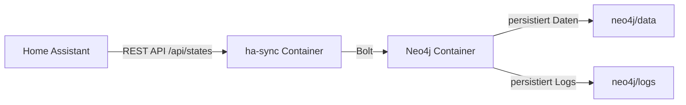

# Home Assistant to Neo4j Sync

Dieses Projekt enthält eine Docker-Compose-Konfiguration für Neo4j und einen Python-Sync-Container, der Home Assistant-States nach Neo4j schreibt.

## Inhalt

- `docker-compose.yml` - Startet Neo4j und den `ha-sync`-Container
- `ha-sync/Dockerfile` - Build-Definition für den Sync-Container
- `ha-sync/requirements.txt` - Python-Abhängigkeiten
- `ha-sync/sync.py` - Sync-Skript
- `neo4j/` - Neo4j-Daten- und Log-Verzeichnis (diese Ordner werden nicht ins Git übernommen)

## Vorbereitung für Git

- `neo4j/data/` und `neo4j/logs/` sind in `.gitignore` enthalten, damit lokale Daten und Logs nicht ins Repository gelangen.
- `.env`-Dateien sind ebenfalls ignoriert.

## Setup

1. `.gitignore` prüfen und sicherstellen, dass lokale Datenverzeichnisse nicht versioniert werden.
2. `docker-compose.yml` anpassen:
   - Setze `HA_TOKEN` auf das tatsächliche Home Assistant Long-Lived Access Token
   - Passe `HA_URL` an deine Home Assistant-URL an
   - Passe bei Bedarf `NEO4J_AUTH` an

3. Starte das Projekt:

```bash
docker compose up -d --build
```

## Architektur

Dieses Projekt besteht aus zwei Containern, die im selben Docker-Netzwerk laufen:

- `neo4j`: Neo4j-Datenbank mit persistierenden Volumes für Daten und Logs
- `ha-sync`: Python-Container, der Home Assistant-States abruft und nach Neo4j schreibt



Die wichtigsten Abläufe:

1. `ha-sync` ruft von Home Assistant alle Entity-States ab.
2. `ha-sync` validiert und normalisiert die erhaltenen Werte.
3. `ha-sync` schreibt die Entities, Räume und Relationen nach Neo4j.
4. Neo4j speichert alles in `neo4j/data` und schreibt Logs nach `neo4j/logs`.

## Deployment / Einsatz

### Lokale Vorbereitung

1. Erstelle optional eine Datei `.env` im Projektordner mit folgenden Werten:

```ini
HA_URL=http://homeassistant.local:8123
HA_TOKEN=DEIN_HOME_ASSISTANT_TOKEN
NEO4J_URI=bolt://neo4j:7687
NEO4J_USER=neo4j
NEO4J_PASSWORD=ChangeMe123!
SYNC_INTERVAL_SECONDS=300
```

2. Passe `docker-compose.yml` an, falls du die Werte aus `.env` verwenden möchtest:

```yaml
environment:
  - HA_URL=${HA_URL}
  - HA_TOKEN=${HA_TOKEN}
  - NEO4J_URI=${NEO4J_URI}
  - NEO4J_USER=${NEO4J_USER}
  - NEO4J_PASSWORD=${NEO4J_PASSWORD}
  - SYNC_INTERVAL_SECONDS=${SYNC_INTERVAL_SECONDS}
```

### Start

```bash
docker compose up -d --build
```

### Überwachung

- Neo4j Browser: http://localhost:7474
- Sync-Logs ansehen:

```bash
docker compose logs -f ha-sync
```

### Anpassung

- `SYNC_INTERVAL_SECONDS`: Intervall zwischen Sync-Durchläufen in Sekunden
- `NEO4J_AUTH` / `NEO4J_PASSWORD`: Passe bei Bedarf die Neo4j-Zugangsdaten an

## Code Dokumentation

Das Projekt besteht aus folgenden Kernkomponenten:

- `docker-compose.yml`: Stellt Neo4j und den `ha-sync`-Container bereit.
- `ha-sync/Dockerfile`: Baut das Python-Image und installiert die benötigten Bibliotheken.
- `ha-sync/requirements.txt`: Enthält `requests` und den offiziellen `neo4j` Python-Treiber.
- `ha-sync/sync.py`: Führt den eigentlichen Synchronisationsprozess aus.

### `ha-sync/sync.py`

- `HA_URL`, `HA_TOKEN`, `NEO4J_URI`, `NEO4J_USER`, `NEO4J_PASSWORD`: Werden aus Umgebungsvariablen geladen.
- `get_ha_states()`: Ruft die Home Assistant-Entity-States über `/api/states` ab.
- `room_from_attributes()`: Bestimmt den Raum/Area-Namen aus den Entity-Attributen.
- `create_constraints()`: Legt Neo4j-Eindeutigkeitsbedingungen für Entity-, Room-, DeviceClass- und Unit-Knoten an.
- `sync_entity()`: Schreibt oder aktualisiert einen Entity-Knoten und seine Beziehungen.
- `run_sync()`: Führt einen kompletten Sync-Durchlauf aller Entities aus.
- `wait_for_neo4j()`: Wartet auf die Verfügbarkeit der Neo4j-Datenbank.

### Umgebungsvariablen

- `HA_URL`: Basis-URL von Home Assistant, z. B. `http://homeassistant.local:8123`
- `HA_TOKEN`: Home Assistant Long-Lived Access Token
- `NEO4J_URI`: Neo4j-Verbindungs-URI, z. B. `bolt://neo4j:7687`
- `NEO4J_USER`: Neo4j-Benutzername
- `NEO4J_PASSWORD`: Neo4j-Passwort
- `SYNC_INTERVAL_SECONDS`: Optional, Standard ist `300`

## Zusätzliche Dokumentation

- `docs/DEPLOYMENT.md`: Deployment-Checkliste und Betriebshinweise
- `docs/ARCHITECTURE.md`: Architekturübersicht des Sync-Systems
- `docs/FAQ.md`: Häufig gestellte Fragen und Fehlerbehebung

## Hinweise

- Verwende niemals echte Passwörter oder Tokens im Repository.
- Für sensible Werte kannst du stattdessen eine lokale `.env`-Datei anlegen und in `docker-compose.yml` auf diese Werte verweisen.
- Der Neo4j-Datenordner bleibt lokal und wird nicht committet.
