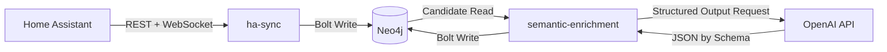

# Architektur

Dieses Repository implementiert eine Pipeline von Home Assistant nach Neo4j mit nachgelagerter semantischer Anreicherung.

## Systemkomponenten

1. `neo4j`
2. `ha-sync`
3. `semantic-enrichment`

## Datenfluss

1. `ha-sync` liest States und Registry-Daten aus Home Assistant.
2. `ha-sync` schreibt normalisierte Knoten/Relationen in Neo4j.
3. `semantic-enrichment` liest Kandidaten aus Neo4j.
4. OpenAI liefert schema-validierte semantische Ergebnisse.
5. `semantic-enrichment` persistiert neue Relationen/Knoten in Neo4j.

## Diagramm

## `ha-sync` Verantwortung

- Home Assistant API-Zugriff (`/api/states`, Registry-Endpunkte)
- Normalisierung von Attributen
- Aufbau von Kernknoten wie `Entity`, `Area`, `Device`, `Domain`, `Automation`
- Erzeugen von Basisrelationen fuer Analysen und Enrichment

## `semantic-enrichment` Verantwortung

Aktive Enricher:

1. `semantic_roles`
2. `automation_intent`
3. `fault_analysis`
4. `anomaly_detection`
5. `room_inference`
6. `dependency_reasoning`
7. `failure_impact`
8. `semantic_descriptions`
9. `recommended_actions`

Die Komponente nutzt einen gemeinsamen Basistyp (`enrichers/base.py`) mit einheitlichem Kontrollfluss: Kandidaten lesen, LLM aufrufen, Ergebnis validieren, Graph schreiben.

## Persistenz und Betrieb

- Persistenz: `neo4j/data`
- Logs: `neo4j/logs`
- Deployment-Orchestrierung: `docker-compose.yml`

## Designentscheidungen

- Enricher sind fachlich getrennt, damit Prompts/Schemas pro Aufgabe evolvieren koennen.
- JSON-Schema-Ausgabe erzwingt konsistente maschinenlesbare LLM-Antworten.
- Confidence-Grenze (`MIN_CONFIDENCE`) verhindert aggressives Schreiben unsicherer Ergebnisse.
