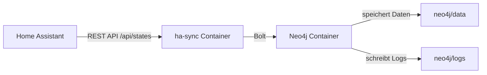

# Architektur

Diese Architektur-Dokumentation beschreibt den Aufbau des Home Assistant → Neo4j Sync-Projekts.

## Komponenten

- `docker-compose.yml`
  - Stellt zwei Container bereit:
    - `neo4j`: Neo4j-Datenbank
    - `ha-sync`: Python-basiertes Sync-Skript
- `ha-sync/Dockerfile`
  - Baut das Python-Image mit `requests` und dem offiziellen `neo4j`-Treiber.
- `ha-sync/sync.py`
  - Liest Home Assistant-States über die REST-API und schreibt sie per Bolt in Neo4j.
- `neo4j/data` und `neo4j/logs`
  - Persistente Daten- und Log-Verzeichnisse für Neo4j.

## Datenfluss

1. Der `ha-sync`-Container verbindet sich mit Home Assistant über die URL `HA_URL`.
2. Er ruft die Entitäten über den Endpunkt `/api/states` ab.
3. Für jede Entity wird geprüft, ob sie bereits in Neo4j existiert.
4. Entity-, Room-, DeviceClass- und Unit-Knoten werden angelegt oder aktualisiert.
5. Beziehungen wie `LOCATED_IN`, `HAS_DEVICE_CLASS` und `MEASURED_IN` werden aufgebaut.

## Systemdiagramm

## Ablauf in `ha-sync/sync.py`

- `get_ha_states()` holt alle Entity-States von Home Assistant.
- `room_from_attributes()` bestimmt den Raum oder die Area des Geräts.
- `create_constraints()` definiert Neo4j-Constraints zur Vermeidung doppelter Knoten.
- `sync_entity()` schreibt oder aktualisiert eine einzelne Entity und deren Beziehungen.
- `run_sync()` führt die Synchronisation für alle Entities aus.
- `wait_for_neo4j()` stellt sicher, dass Neo4j erreichbar ist, bevor Daten geschrieben werden.

## Vorteile dieser Architektur

- Einfaches Setup mit Docker Compose
- Trennung von Datenbank und Sync-Logik
- Persistente Neo4j-Daten ohne Commit in Git
- Flexible Konfiguration über Umgebungsvariablen

## Erweiterungsmöglichkeiten

- Zusätzliche Home Assistant-Endpoints synchronisieren
- Mehr Entitäten und Attribute abbilden
- Fehlerhandling und Metriken erweitern
- Optionaler Data-Export aus Neo4j
