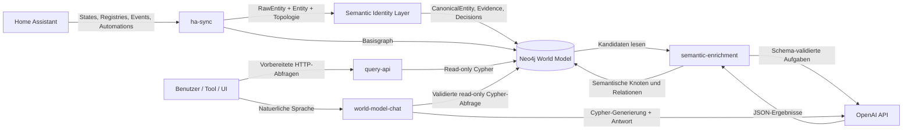
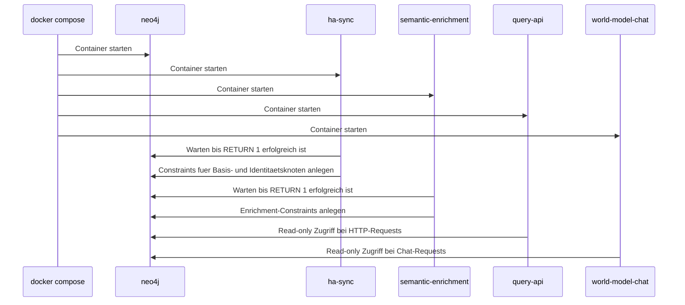
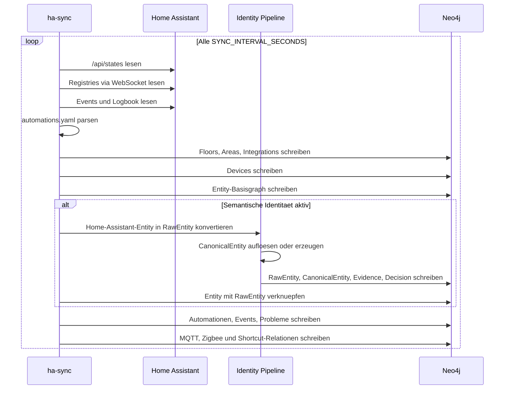
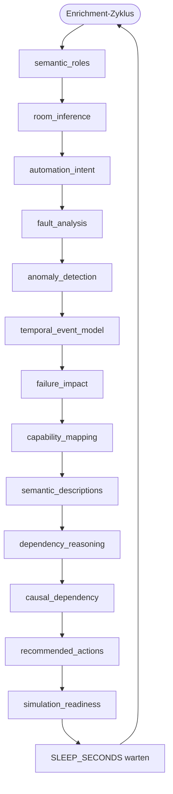
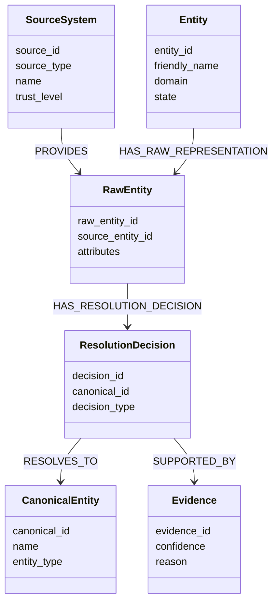
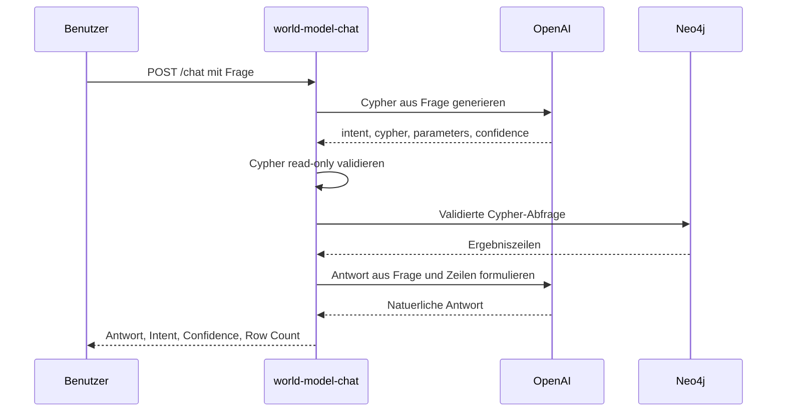
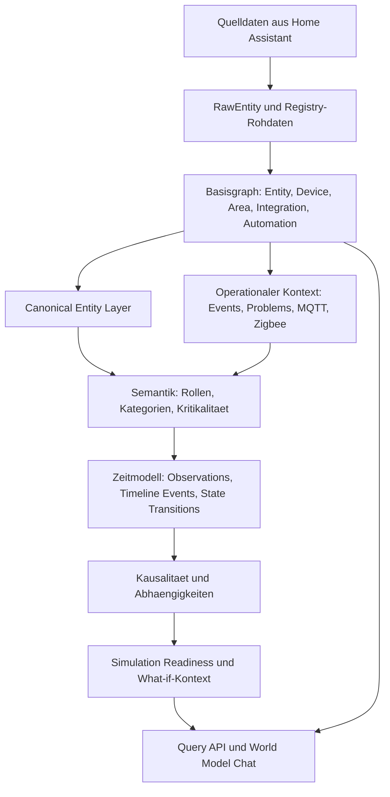

# Zeitliche und funktionale Projektbeschreibung

Dieses Dokument beschreibt, wie das Projekt `HA-CPsWMS` zeitlich und funktional arbeitet. Es verbindet Home-Assistant-Daten, eine semantische Identitaetsschicht, Neo4j-Persistenz, LLM-basierte Anreicherung und Abfrageoberflaechen zu einem semantischen World Model fuer Smart-Home-Systeme.

## Zielbild

Das System behandelt Home Assistant nicht als einzige Wahrheit, sondern als Datenquelle fuer ein dauerhaftes semantisches Modell. Rohdaten aus Home Assistant werden in Neo4j gespeichert, zu stabilen kanonischen Identitaeten aufgeloest, semantisch angereichert und anschliessend ueber feste APIs oder natuerlichsprachliche Fragen auswertbar gemacht.

## Laufzeitstart

Der Stack wird ueber `docker-compose.yml` gestartet. Neo4j ist die zentrale Persistenzschicht. Die Worker und APIs verbinden sich per Bolt mit Neo4j.

Zeitlich passiert beim Start Folgendes:

1. `neo4j` startet und stellt Browser UI auf Port `7474` sowie Bolt auf Port `7687` bereit.
2. `ha-sync` startet, wartet auf Neo4j, legt Constraints fuer die wichtigsten Knotentypen an und beginnt den zyklischen Import.
3. `semantic-enrichment` startet, wartet ebenfalls auf Neo4j, initialisiert alle Enricher und legt gemeinsame sowie enricher-spezifische Constraints an.
4. `query-api` startet als HTTP-API auf Port `8080` und liest bei Anfragen aus Neo4j.
5. `world-model-chat` startet als FastAPI-Service auf Port `8090` und beantwortet natuerlichsprachliche Fragen ueber validierte Cypher-Abfragen.

## Zeitlicher Hauptablauf

Das Projekt besteht aus zwei kontinuierlichen Schreibschleifen und zwei lesenden Schnittstellen.

### 1. Home-Assistant-Synchronisation

`ha-sync/sync.py` laeuft dauerhaft. Nach dem Start wartet es auf Neo4j, erstellt Constraints und fuehrt dann alle `SYNC_INTERVAL_SECONDS` einen kompletten Synchronisationslauf aus. Standardwert ist `300` Sekunden.

In einem Synchronisationslauf werden zuerst die aktuellen Daten aus Home Assistant gelesen:

- States ueber `/api/states`
- Entity-, Device-, Area-, Floor- und Config-Entry-Registry ueber Home-Assistant-WebSocket-Kommandos
- Event-Typen und Logbook-Eintraege, sofern `ENABLE_EVENT_HISTORY=true`
- Automationen aus dem konfigurierten YAML-Pfad `AUTOMATIONS_YAML_PATH`

Danach schreibt `ha-sync` die Daten in fester Reihenfolge in Neo4j:

1. Floors
2. Areas
3. Integrations
4. Devices
5. SourceSystem fuer die semantische Identitaetsschicht
6. Entities mit Domain, State, DeviceClass, Unit, Area, Device und Integration
7. RawEntity, CanonicalEntity, Evidence und ResolutionDecision, sofern `ENABLE_SEMANTIC_IDENTITY=true`
8. Automationen aus States und YAML
9. Event-Typen und Logbook-Ereignisse
10. Problem-Knoten fuer `unavailable`, `unknown`, `none` oder fehlende States
11. MQTT- und Zigbee-Modell, sofern aktiviert
12. Abgeleitete Shortcut-Relationen wie `CAN_CAUSE` und `EFFECTIVE_LOCATION`

### 2. Semantische Anreicherung

`semantic-enrichment/semantic_enrich.py` laeuft ebenfalls dauerhaft. Nach der Initialisierung fuehrt es alle Enricher in einer bewusst gewaehlten Reihenfolge aus und schlaeft danach `SLEEP_SECONDS` Sekunden. Standardwert ist ebenfalls `300` Sekunden.

Der Ablauf eines einzelnen Enrichers ist immer gleich:

1. Kandidaten aus Neo4j lesen.
2. Payload mit Taskname, Kandidaten und Regeln erzeugen.
3. OpenAI mit Prompt und JSON-Schema aufrufen.
4. JSON-Antwort parsen.
5. Ergebnisse validieren, inklusive Confidence-Pruefung gegen `MIN_CONFIDENCE`.
6. Gueltige Ergebnisse als semantische Knoten und Relationen in Neo4j schreiben.

Die Enricher laufen in dieser Reihenfolge:

1. `semantic_roles`
2. `room_inference`
3. `automation_intent`
4. `fault_analysis`
5. `anomaly_detection`
6. `temporal_event_model`
7. `failure_impact`
8. `capability_mapping`
9. `semantic_descriptions`
10. `dependency_reasoning`
11. `causal_dependency`
12. `recommended_actions`
13. `simulation_readiness`

Die Reihenfolge ist funktional wichtig: Basissemantik und Raumkontext werden zuerst erzeugt, danach folgen Automations-, Fehler-, Anomalie- und Zeitmodelle. Hoehere Analysen wie Impact, Capabilities, Abhaengigkeiten, empfohlene Aktionen und Simulation Readiness bauen auf diesen frueheren Schichten auf.

## Funktionale Architektur

### `ha-sync`

`ha-sync` ist die Quelle der aktuellen Home-Assistant-Sicht. Es erzeugt den Basisgraphen mit Entitaeten, Geraeten, Bereichen, Stockwerken, Integrationen, Automationen, Events und Problemzustaenden.

Wichtige funktionale Aufgaben:

- Home-Assistant-REST- und WebSocket-Zugriff.
- Normalisierung komplexer Attributwerte in string- oder JSON-kompatible Werte.
- Aufbau von `Entity`, `Device`, `Area`, `Floor`, `Domain`, `DeviceClass`, `Unit`, `Integration`, `Automation`, `EventType` und `Problem`.
- Ableitung von Automationsbeziehungen wie `TRIGGERED_BY`, `CONTROLS` und `HAS_CONDITION`.
- Modellierung technischer Infrastruktur wie MQTT-Themen und Zigbee-Knoten.
- Einspeisung in die semantische Identitaetsschicht.

### Semantische Identitaetsschicht

Die semantische Identitaetsschicht entkoppelt Rohdaten von stabilen Identitaeten. Home Assistant liefert konkrete Quellobjekte, die als `RawEntity` gespeichert werden. Die Identity Pipeline loest sie gegen eine kanonische Sicht auf und erzeugt bei Bedarf `CanonicalEntity`-Knoten.

Wichtige Knotentypen:

- `SourceSystem`: beschreibt die Quelle, hier `homeassistant`.
- `RawEntity`: quellenspezifische Rohdarstellung.
- `CanonicalEntity`: stabile semantische Identitaet.
- `Evidence`: Begruendung fuer eine Zuordnung.
- `ResolutionDecision`: Entscheidung der Aufloesungspipeline.

### `semantic-enrichment`

`semantic-enrichment` liest den vorhandenen Graphen, erzeugt semantische Zusatzinformationen und schreibt sie zurueck. Jeder Enricher ist fachlich getrennt und besitzt eigene Prompts und JSON-Schemas. Dadurch koennen einzelne Analysearten unabhaengig weiterentwickelt werden.

Typische Ergebnisrelationen sind:

- `HAS_SEMANTIC_ROLE`
- `HAS_SEMANTIC_CATEGORY`
- `HAS_CRITICALITY`
- `HAS_AUTOMATION_INTENT`
- `HAS_ANOMALY`
- `HAS_OBSERVATION`
- `HAS_TIMELINE_EVENT`
- `HAS_STATE_TRANSITION`
- `HAS_INCIDENT`
- `PROVIDES_CAPABILITY`
- `CAUSES`
- `DEPENDS_ON`
- `IMPACTS`
- `DEGRADES`
- `RECOVERS`
- `HAS_FAILURE_IMPACT`
- `HAS_RECOMMENDED_ACTION`
- `HAS_SIMULATION_READINESS`

### `query-api`

`query-api/app.py` ist eine feste HTTP-Schicht fuer wiederkehrende Auswertungen. Sie generiert keine Cypher-Abfragen mit LLMs, sondern kapselt vorbereitete read-only Cypher-Queries.

Wichtige Endpunkte:

- `GET /health`
- `GET /api/capabilities`
- `GET /api/simulation-readiness`
- `GET /api/what-if/integration/{domain}`
- `GET /api/what-if/capability/{name}`
- `GET /api/entities/{entity_id}/impact`

Diese API eignet sich fuer UIs, Dashboards, Automatisierungen und externe Tools, die stabile Antwortformate benoetigen.

### `world-model-chat`

`world-model-chat/app.py` ist die natuerlichsprachliche Abfrageschicht. Bei `POST /chat` passiert folgender Ablauf:

1. Die Frage wird an OpenAI gesendet.
2. OpenAI liefert eine strukturierte Cypher-Beschreibung gemaess JSON-Schema.
3. Der Service validiert die Cypher-Abfrage.
4. Nur read-only Abfragen mit `MATCH` oder `OPTIONAL MATCH`, `RETURN` und `LIMIT` werden akzeptiert.
5. Schreibende oder administrative Cypher-Muster wie `CREATE`, `MERGE`, `SET`, `DELETE`, `DROP`, `CALL`, `LOAD CSV` oder `APOC` werden abgelehnt.
6. Die validierte Abfrage wird gegen Neo4j ausgefuehrt.
7. Die Ergebniszeilen werden an OpenAI gegeben, um eine lesbare Antwort zu formulieren.

## Datenmodell in Schichten

Das World Model entsteht nicht in einem einzigen Schritt, sondern in Schichten:

## Zeitliche Konsistenz und Aktualisierung

Das System ist eventual-consistent. `ha-sync` und `semantic-enrichment` laufen unabhaengig voneinander in Intervallen. Dadurch kann es kurze Zeitfenster geben, in denen neue Home-Assistant-Entities bereits im Basisgraphen vorhanden sind, aber noch keine semantischen Rollen, Impact-Analysen oder Simulation-Readiness-Bewertungen besitzen.

Die typische zeitliche Entwicklung einer neuen Entity ist:

1. Home Assistant stellt eine neue Entity bereit.
2. Beim naechsten `ha-sync`-Lauf wird sie als `Entity` in Neo4j geschrieben.
3. Falls semantische Identitaet aktiv ist, wird eine `RawEntity` erzeugt und einer `CanonicalEntity` zugeordnet.
4. Beim naechsten `semantic-enrichment`-Zyklus erscheint sie als Kandidat fuer passende Enricher.
5. Nach erfolgreichen LLM-Antworten und Confidence-Pruefung entstehen semantische Relationen.
6. Query API und Chat koennen die neue Entity zunehmend reichhaltiger beantworten.

## Betriebs- und Sicherheitsgrenzen

- Schreibzugriffe erfolgen durch `ha-sync` und `semantic-enrichment`.
- `query-api` liest ausschliesslich vorbereitete Graphabfragen.
- `world-model-chat` validiert LLM-generierte Cypher-Abfragen streng vor der Ausfuehrung.
- Secrets wie `HA_TOKEN`, `NEO4J_PASSWORD` und `OPENAI_API_KEY` werden ueber Umgebungsvariablen bereitgestellt.
- Neo4j-Daten liegen lokal unter `neo4j/data`, Logs unter `neo4j/logs`.

## Zusammenfassung

Funktional baut das Projekt aus Home-Assistant-Daten ein semantisches, abfragbares Smart-Home-Weltmodell. Zeitlich arbeitet es in wiederkehrenden Zyklen: zuerst werden aktuelle HA-Daten importiert und identitaetsstabil gespeichert, danach werden semantische und kausale Schichten angereichert. Lesende Schnittstellen greifen jederzeit auf den jeweils aktuellen Stand des Graphen zu.
